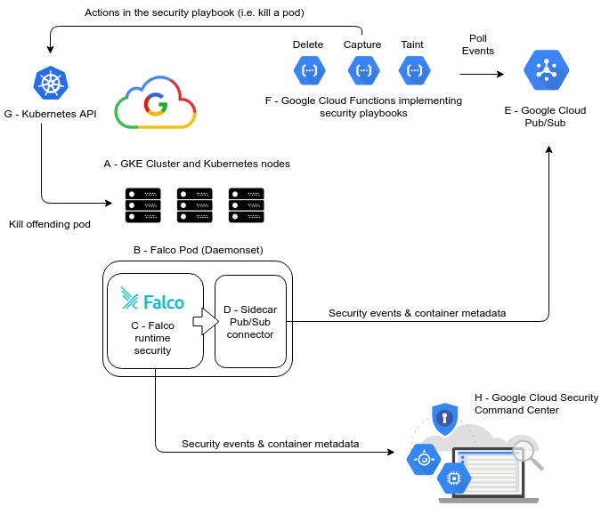

# A [FalcoSecurity Falco](https://github.com/falcosecurity/falco) POD with FleuentD logshipping to [SumoLogic](https://www.sumologic.com)          
---
#### What is this?
- [Intrusion Detection System](https://en.wikipedia.org/wiki/Intrusion_detection_system), [File Integrity Monitoring](https://en.wikipedia.org/wiki/File_integrity_monitoring), [Malware detection](https://en.wikipedia.org/wiki/Malware), etc.. for GKE/Kubernetes 
  

//TODO patch and harden Falco container image. apply a PSP.. 
// PSP: Disable Exec into Falco container
//TODO Add an internet network egress policy that only allows the falco daemon to dowload it's eBPF stuff
// connect to sumologic, get PKI stuff, etc

[Open source falco homepage](https://falco.org)     
[Falco GitHub project](https://github.com/falcosecurity/falco)    

//TODO: How do I add a new alert?
//TODO: How do I contribute to the Falco project

[How to deploy](./docs/deploy.md)     
-FalcoSecurity: Falco for acme k8s environments:    
//TODO the sidecar automation component does not yet exist!!
    
*Fig1: Falco Architecure*
---
2020 - acme Security Team    
security@acme.com   
